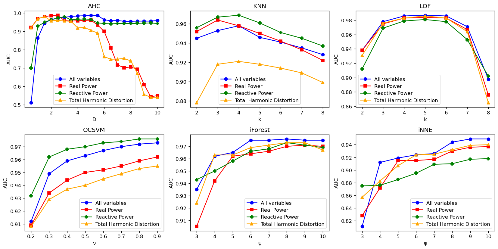

# Unsupervised-Learning-for-Anomaly-Detection-in-Fleet-Based-Systems-Application-to-Air-Conditioners
### AUC scores by variable and parameters

This plot contains the AUC scores for the six algorithms corresponding to each hyperparameter value.

### Understanding the code
The tools folder contains all the classes and methods programmed for this project. Calculations.py contains the class Calculations, which includes methods for computing real power, reactive power, apparent power, and total harmonic distortion from the binary files. Simulate.py contains the class  Simulate which includes methods for simulating the fleet data-sets. Cluster.py is an abstract class that includes methods used by all of the six algorithms we used. The remaining six files contain classes for the algorithms used in this paper, each of these implements the abstract class Cluster.

The jupyter notebook files have examples of the code written in tools. ''AUC Parameter Plots.ipynb`` has the plot for AUC scores by variable and parameters. Calculations.ipynb contains plots for current and voltage and shows how the Calculations class is used. Data.ipynb shows how the Simulate class is used and has plots for real power, reactive power, and total harmonic distortion. Finally, ExampleScores.ipynb shows how our anomaly detection methods created implemented. 

The runners folder contains a jupyter notebook for each algorithm implementation with the hyperparameter optimization plots.